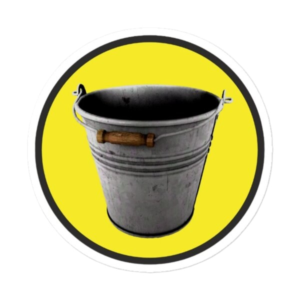

# Bucket

A GPT discord bot that uses your own server for training data. This repo is to help you build that bot.

## Why'd you name it Bucket?
seemed funny.

# Getting Started

## Step 0 - Stuff you need
You will need:
- Python
- Node.JS
- (at least) 5 dollars

## Step 1 - Prep
  1. To get started, you'll need chat data. Use DiscordChatExporter: https://github.com/Tyrrrz/DiscordChatExporter

  2. In DiscordChatExporter, choose the channel you want to use for the training data, make sure to download it as `json`. This will probably take a while.

 You will probably want to set a partition limit! I used `10mb`.

  3. Once you have your json files, make a folder called `dirty-data` in the `preparation` folder, and put all the json files in there.

  4. Run the `jsoncleaner.py` python script.

  5. When asked, enter your system prompt. 
  
  Your system prompt sets the "context" for the AI Model, as well as placing restrictions or "boundaries" on its responses. You may want to write this down for future steps, but you can also just grab it from the `output.jsonl` file.

## Step 2 - Training
**This step will cost you at least $5**

There *is* a script in the training folder, but I would just use the web ui for this: https://platform.openai.com/finetune/

You can only use `gpt-3.5-turbo-xxxx` models for fine tuning with the data you've generated.

Training will also take a while, especially if you've given it a lot of data. For me training a GPT3.5 model with ~2048 lines of data will run you about $2.

## Step 3 - Validation

1. Rename `config.sample.json` to `config.json` and enter your API Key, Model ID, and system prompt into the specified fields

> **A note on system prompts**
> 
> While you're in `config.json`, you need to add a system prompt. This sets the guidelines and "boundaries" that the AI *mostly* follows. You can use the same system prompt that was used in `jsoncleaner.py`, but now would be the best time to mess around and see what gives you the best results. 

2. Also, specify your token amount if you want, this controls how long the messages that the bot replies with are. 

3. Open a terminal/command prompt in the `/validation/` folder and run `node chatbot.js`

4. You can now chat with the bot you made! Make sure it's a bit normal, and retrain your model as needed.

## Step 4 - Releasing it into the wild (Discord)

### Bucket will want to say slurs after a while. There's a filter in place which should block most if not all of them, and a well crafted system prompt will prevent some as well. We will need a better solution for "ignoring" them from OpenAI's data.

1. Rename `config.sample.json` to `config.json`, enter your Discord API key, and then just copy the rest of your settings from `validation/config.json`.

2. Enter the ID of the channel you want the bot to monitor for pings and respond in into the `allowedChannelId` node.

`allowedChannelId` can also be the ID of a thread, if that's more your speed.
 
3. Open a terminal/command prompt in the `/bot/` folder and run `node bucket2.mjs`

If you're having issues with the bot, make sure the dependencies are installed by running `npm install discord.js node-fetch openai`

Bucket will log responses, and who triggered the bot in the `/bot/logs/` folder. 

## Future Plans
- Better Emote Support
- Working "train from bot response" system

## Contributing
Feel Free! If you want to change something just open a PR.
